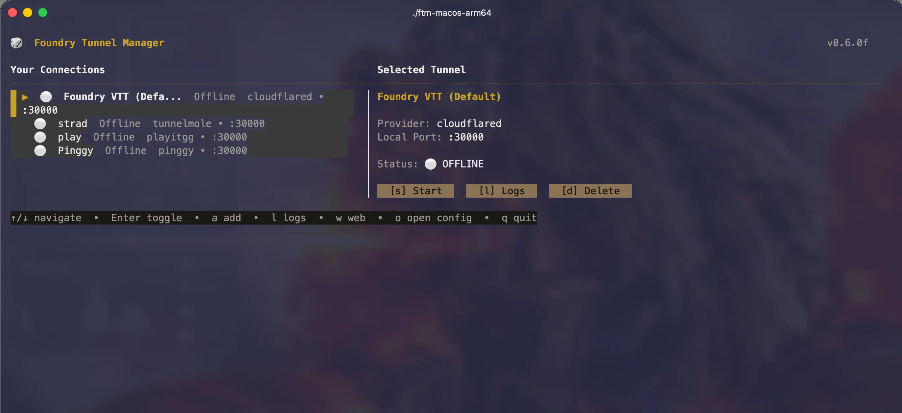
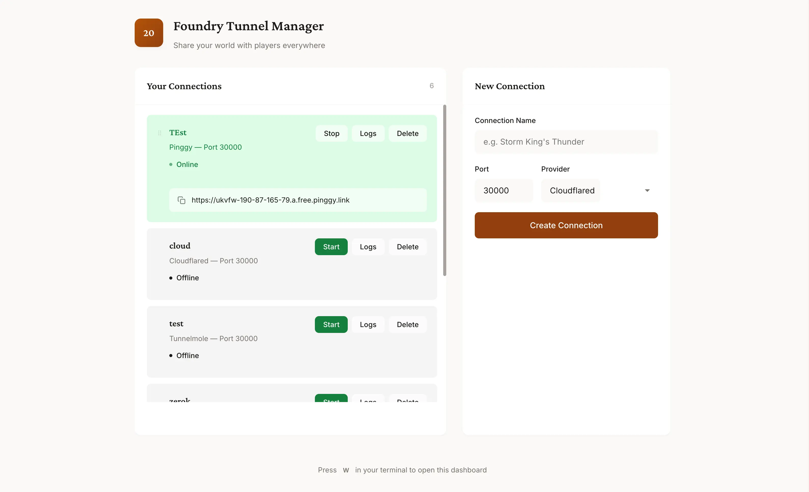

# Foundry Tunnel Manager

Share your Foundry VTT world with players anywhere. No port forwarding needed.

## Features

- **6 tunnel providers**: Cloudflared, Playit.gg, localhost.run, Serveo, Pinggy, Tunnelmole
- **3 interfaces**: TUI, Web dashboard, Desktop app (Tauri v2)
- **Auto-install**: Downloads providers automatically
- **Drag & drop**: Reorder connections
- **Real-time updates**: Live status changes
- **Theming**: Multiple themes for web dashboard

## Quick Start

```bash
# Install
go install github.com/deadbryam/ftm@latest

# Run
ftm              # TUI
ftm --web        # Web dashboard only
```

**TUI shortcuts:** `↑/↓` navigate, `s` start/stop, `l` logs, `c` copy URL, `w` web, `a` add, `d` delete, `q` quit

## Interfaces

### TUI


### Web Dashboard


Access at `http://localhost:8080`

### Desktop App (Tauri v2)

```bash
cd desktop
npm install
npm run tauri build
```

## Build from Source

**Requirements:**
- Go 1.21+
- Node.js 18+ (for Tauri desktop)
- Rust (for Tauri desktop)

```bash
# Clone
git clone https://github.com/deadbryam/ftm.git
cd ftm

# Build CLI & Web
go build -o ftm ./cmd/ftm

# Build Desktop App (optional)
cd desktop
npm install
npm run tauri build
```

## Contributing

1. Fork the repo
2. Create a branch: `git checkout -b feature/amazing`
3. Commit: `git commit -m "Add amazing feature"`
4. Push: `git push origin feature/amazing`
5. Open a Pull Request

## License

MIT License - Copyright (c) 2024 deadbryam

See [LICENSE](LICENSE) for details.
